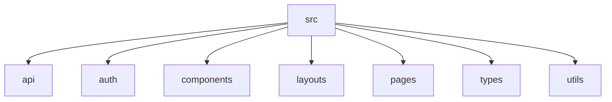

# Practicare Frontend

O Practicare é um sistema de desenvolvido inicialmente como projeto de aprendizagem para aprimorar minhas habilidades e conhecimentos em desenvolvimento de software. Ele é composto por este projeto [**Practicare Frontend**](https://github.com/psifabiohenrique/practicare_frontend) e o [**Practicare FastAPI**](https://github.com/psifabiohenrique/practicare_fastapi).

O **Practicare Frontend** é foi desenvolvido utilizando react, typescript, vite e axios. Tecnologias amplamente utilizadas no mercado de trabalho e que permitem um desenvolvimento rápido, eficiente e com qualidade.

---

## 📸 Demonstração

<!--
Comentário: Aqui deve ser inserida uma imagem ou GIF da Dashboard principal do sistema,
mostrando a visão geral dos agendamentos ou estatísticas.
-->


---

## 🚀 Como Executar o Projeto

### Pré-requisitos

- [Node.js](https://nodejs.org/) (versão 18 ou superior recomendada)
- [npm](https://www.npmjs.com/) ou [yarn](https://yarnpkg.com/)

### Instalação

1. Clone o repositório:

```bash
git clone <url-do-repositorio>
cd practicare_frontend
```

2. Instale as dependências:

```bash
npm install
```

3. Execute o projeto em modo de desenvolvimento:

```bash
npm run dev
```

O projeto estará disponível em `http://localhost:5173`.

---

## 🏗️ Arquitetura

O projeto utiliza **React** com **TypeScript** e é construído sobre o **Vite** para um desenvolvimento rápido.

### Estrutura de Pastas

- `/src/api`: Serviços de integração com a API (Axios).
- `/src/auth`: Contexto e lógica de autenticação.
- `/src/components`: Componentes reutilizáveis de UI.
- `/src/layouts`: Layouts principais (ex: MainLayout com Sidebar).
- `/src/pages`: Páginas da aplicação organizadas por módulos (Dashboard, Patients, etc.).
- `/src/types`: Definições de tipos TypeScript.
- `/src/utils`: Funções utilitárias e helpers.



<!--
Comentário: Aqui pode ser inserido um diagrama de arquitetura ou fluxo de dados (ex: Mermaid ou imagem estática).
-->

---

## ✨ Funcionalidades

- **Autenticação**: Sistema de Login e Gerenciamento de Sessão com Refresh Token (HTTP-only Cookies).
- **Dashboard**: Visão geral e atalhos rápidos.
- **Gestão de Pacientes (CRUD)**:
  - Listagem com filtros, busca e paginação.
  - Detalhes completos do paciente e seus tratamentos.
  - Criação e edição de pacientes.
- **Agenda de Sessões**: Visualização dos tratamentos diários.
- **Interface Responsiva**: Design moderno e adaptável (Vanilla CSS).
- **Dark Mode**: Tema escuro para melhor experiência visual. (a desenvolver)
- **Gestão de prontuários (CRUD)**:
  - Listagem com filtros, busca e paginação.
  - Detalhes completos do prontuário e seus tratamentos.
  - Criação e edição de prontuários.
- **Gestão de relatórios (CRUD)**:
  - Listagem com filtros, busca e paginação.
  - Detalhes completos do relatório e seus tratamentos.
  - Criação e edição de relatórios.

---

## 🖼️ Ilustrações do Sistema

### Listagem de Pacientes

<!--
Comentário: Imagem mostrando a tela de listagem de pacientes, destacando os filtros e a busca.
-->


### Detalhes do Paciente

<!--
Comentário: Imagem da tela de detalhes, mostrando as informações do paciente e o histórico de tratamentos.
-->


---

### Listagem de Prontuários

<!--
Comentário: Imagem mostrando a tela de listagem de prontuários, destacando os filtros e a busca.
-->


### Detalhes do Prontuário

<!--
Comentário: Imagem da tela de detalhes, mostrando as informações do prontuário e o histórico de tratamentos.
-->


---

### Listagem de Relatórios

<!--
Comentário: Imagem mostrando a tela de listagem de relatórios, destacando os filtros e a busca.
-->


### Detalhes do Relatório

<!--
Comentário: Imagem da tela de detalhes, mostrando as informações do relatório e o histórico de tratamentos.
-->


---

## 🛠️ Tecnologias Utilizadas

- **React 19**
- **TypeScript**
- **Vite**
- **Axios**
- **React Router 7**
- **Vanilla CSS**
