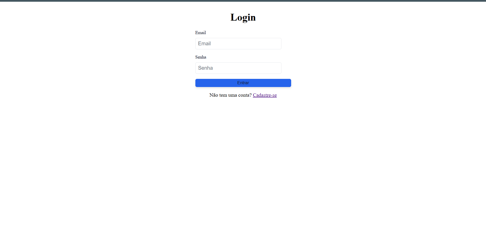
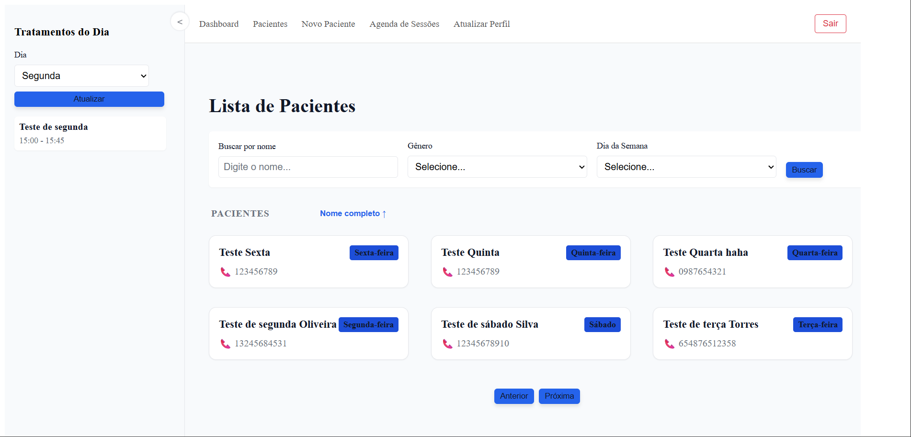
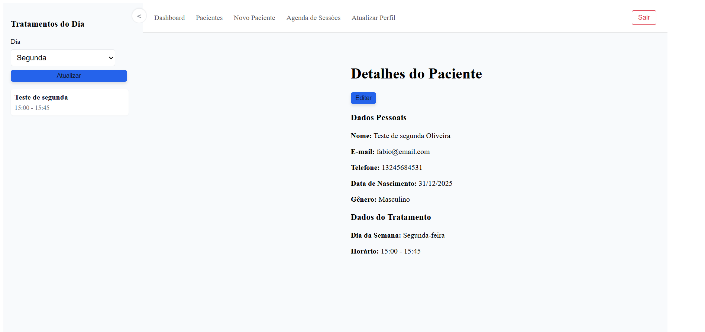
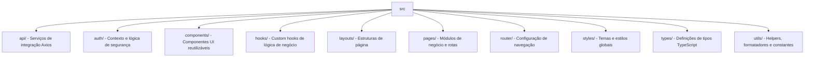

# Practicare Frontend

O **Practicare** é um ecossistema de gestão de saúde inteligente, desenvolvido para otimizar o fluxo de trabalho de profissionais da saúde através de automação por Inteligência Artificial. Este repositório contém o [**Practicare Frontend**](https://github.com/psifabiohenrique/practicare_frontend), que se integra ao [**Practicare FastAPI**](https://github.com/psifabiohenrique/practicare_fastapi) para oferecer uma experiência moderna, fluida e altamente produtiva.

O frontend é construído com **React 19**, **TypeScript** e **Vite**, priorizando performance e uma interface de usuário intuitiva.

---

## 📸 Demonstração





---

## ✨ Funcionalidades Principais

### 1. Automação por IA (Recurso Principal)
- **Transcrição de Áudio**: Upload de áudios de consultas com processamento assíncrono para transcrição automática.
- **Geração de Prontuários**: Criação inteligente de registros clínicos (records) baseados na transcrição ou em notas do profissional.
- **Relatórios de Evolução**: Geração automática de relatórios estruturados (reports) a partir do histórico de tratamentos do paciente.

### 2. Gestão Clínica Completa
- **Dashboard Dinâmico**: Painel de controle com estatísticas de atendimento e atalhos rápidos.
- **Gestão de Pacientes (CRUD)**: Listagem avançada com filtros, busca e criação de perfis detalhados.
- **Prontuários e Relatórios**: Fluxo completo de documentos clínicos com suporte a reprocessamento por IA.
- **Agenda de Sessões**: Visualização inteligente dos tratamentos diários organizada por dia da semana.

### 3. Segurança e Performance
- **Autenticação Robusta**: Sistema baseado em sessões com Cookies HttpOnly e proteção CSRF.
- **Processamento Assíncrono**: Feedback em tempo real para tarefas de longa duração (IA) via jobs em background.
- **Interface Responsiva**: Design moderno e adaptável utilizando Vanilla CSS Modules.
- **Dark Mode**: Suporte a temas (Dark/Light) via variáveis CSS (em aprimoramento).

---

## 🏗️ Arquitetura e Tecnologias

O projeto segue uma estrutura modular focada em escalabilidade e manutenção:

- **React 19**: A última versão do framework com suporte a novas APIs.
- **TypeScript**: Tipagem estática rigorosa para maior segurança e produtividade.
- **React Router 7**: Gestão de rotas robusta e moderna.
- **Axios**: Integração eficiente com a API backend com interceptors de segurança.
- **SweetAlert2**: Feedback visual elegante e interativo para ações do usuário.
- **Vanilla CSS Modules**: Estilização isolada, leve e de alta performance.

### Estrutura de Pastas



---

## 🚀 Como Executar o Projeto

### Pré-requisitos
- [Node.js](https://nodejs.org/) (versão 20+ recomendada)
- [npm](https://www.npmjs.com/) ou [yarn](https://yarnpkg.com/)

### Instalação

1. Clone o repositório:
   ```bash
   git clone https://github.com/psifabiohenrique/practicare_frontend.git
   cd practicare_frontend
   ```

2. Instale as dependências:
   ```bash
   npm install
   ```

3. Configure as variáveis de ambiente:
   ```bash
   cp .env.example .env
   # Edite o .env com a URL da sua API (ex: http://localhost:8000)
   ```

4. Execute o projeto em modo de desenvolvimento:
   ```bash
   npm run dev
   ```

O projeto estará disponível em `http://localhost:5173`.

---

## 🛠️ Tecnologias Utilizadas

- **React 19.2.0**
- **TypeScript 5.9.3**
- **Vite 7.2.4**
- **React Router 7.12.0**
- **Axios 1.13.2**
- **SweetAlert2 11.26.24**
- **React Phone Number Input**

---
Desenvolvido com ❤️ para transformar a gestão na saúde moderna.
